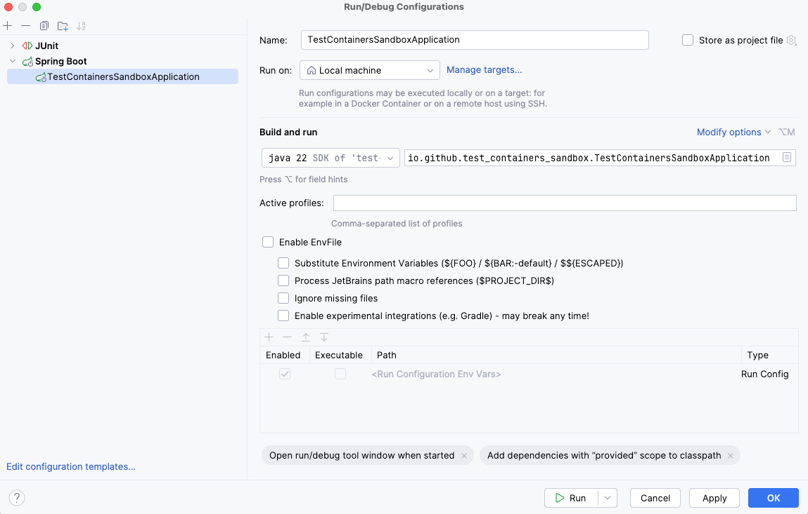

# Test-containers sandbox

This project aims to practice [Testcontainers library](https://testcontainers.com/).

## Getting started

Prerequisites:
 - Docker
 - docker-compose
 - Java 22 & Maven

```shell
docker-compose up
```

**And then:**



## Todolist

 - [Postgres containers](./src/test/java/io/github/test_containers_sandbox/configuration/DatabaseIntegrationTest.java) ✅
 - [S3 containers](./src/test/java/io/github/test_containers_sandbox/configuration/S3IntegrationTest.java) ✅
 - [Kafka containers](./src/test/java/io/github/test_containers_sandbox/configuration/KafkaIntegrationTest.java) 🚧